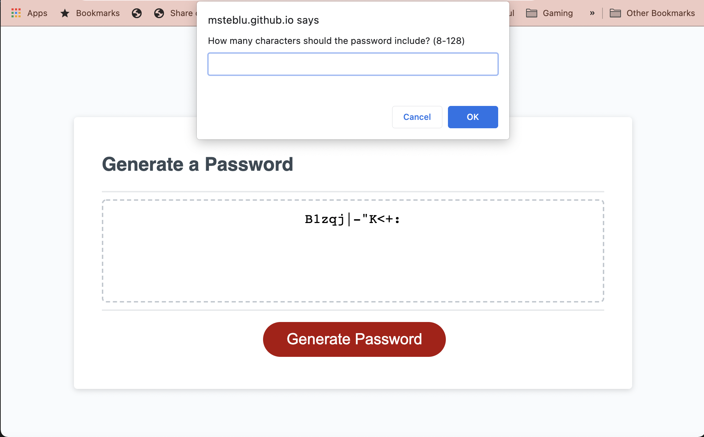

# Password Generator 

## Description

This application was built in order to generate unique and secure passwords - specifically ones that are catered to each individual user. Using JavaScript code, I built an interactive application that asks users for their preferences and then generates a random password based on their needs.

## Installation

The password generator has been deployed to a GitHub Pages site ([here](https://msteblu.github.io/PasswordGenerator_JS/)) where it can be viewed and interacted with. 

The various components of the application (i.e. HTML, CSS, and JS files) can also be accessed through a download and clone. 

## Usage

Navigate to either the deployed ([GitHub site](https://msteblu.github.io/PasswordGenerator_JS/)) or open the index.html file in your browser. From there, you can interact with the application, choosing the length of your password and whether or not you would like it to include lowercase, uppercase, numeric, and/or special characters. 

## Credits

Starter code provided by the University of Minnesota Coding Bootcamp.

## License 

Licensed under the ([MIT](https://github.com/microsoft/vscode/blob/main/LICENSE.txt)) license. 